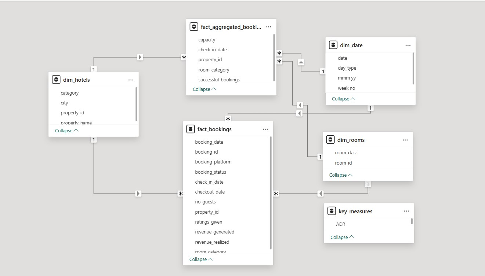
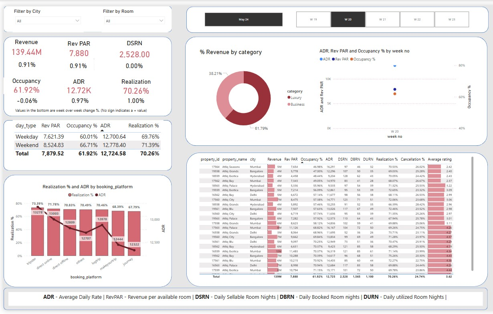
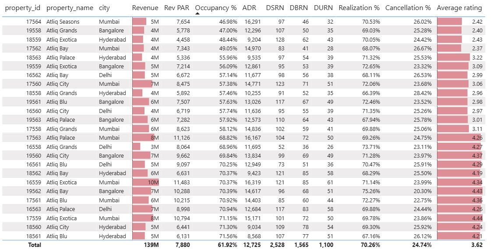

### Hospitality Revenue Analytics

 **Overview**
This project showcases a dynamic Power BI dashboard developed to analyze booking and revenue performance across a 40-property hotel portfolio in 5 Indian cities. Using over 200,000 records, the dashboard enables detailed tracking of occupancy, ADR, revenue, and booking patterns, empowering hotel managers to uncover underperforming properties, optimize pricing, and improve platform/channel efficiency.

 **Tools Used**
- **Power BI** – Dashboard design and interactive data visualization  
- **Power Query** – Data transformation, cleaning, and preparation  
- **DAX (Data Analysis Expressions)** – Calculated columns, measures (e.g., RevPAR, ADR, Occupancy %), and time intelligence logic  
- **Star Schema Modeling** – Structured with 1 fact and 3 dimension tables

 **Screenshots**

**Data Model View**  

**Dashboard Overview**  

**Parameters**  

 **Dataset Files**

The following Excel files were used to build the Power BI dashboard:

- 📥 [dim_date.xlsx](Dataset/dim_date.xlsx)  
- 📥 [dim_hotels.xlsx](Dataset/dim_hotels.xlsx)  
- 📥 [dim_rooms.xlsx](Dataset/dim_rooms.xlsx)  
- 📥 [fact_aggregated_bookings.xlsx](Dataset/fact_aggregated_bookings.xlsx)

 **Power BI File**

- 📊 [hospitality_project.pbix](Power%20BI%20file/hospitality_project.pbix)

**Key Metrics & Insights**
- **RevPAR**, **ADR**, and **Occupancy %** across cities, room types, and platforms  
- **Realization %** and **Cancellation Rate** to assess booking fulfillment  
- **Top/Bottom Performing Hotels** by revenue and occupancy  
- **Channel Efficiency** – Analyze performance by booking platform  
- **Daily/Weekly/Monthly Trends** – For forecasting and strategy

**How to Use / View the Project**
1. Download the `.pbix` file from this repository.  
2. Open the file in **Power BI Desktop**  
3. Explore the dashboard:
   - Use filters for city, date, room type, and booking channel  
   - Hover over visuals for detailed tooltips and trends  
   - Drill down on KPIs for property-level and channel-level insights

### **Interactive Dashboard Link**
[Click to View Dashboard](https://app.powerbi.com/view?r=eyJrIjoiOTJkNzUzNTItYTg4NC00MjJiLTllMGEtZjQ4N2FmYjFhZDFiIiwidCI6ImM2ZTU0OWIzLTVmNDUtNDAzMi1hYWU5LWQ0MjQ0ZGM1YjJjNCJ9)

